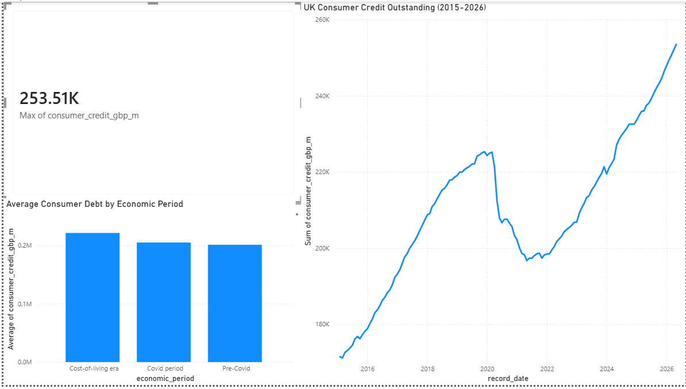

# UK Consumer Credit & Debt Trends Analysis (2015-2026)

An end-to-end data analysis project examining how UK consumer borrowing has
evolved over the last decade, through the pre-pandemic boom, the Covid
lockdown dip, and the cost-of-living crisis. Built with **PostgreSQL** for the
analysis and **Power BI** for the dashboard, using real data from the
**Bank of England**.

---

## Why this project

Consumer borrowing in the UK has changed dramatically since 2015, and the rise
of **Buy Now, Pay Later (BNPL)** has put consumer credit back in the headlines
with the FCA bringing BNPL under formal regulation. This project steps back from
the BNPL headline to ask a broader question: **how has total UK consumer debt
actually moved over the past decade, and what do the major economic shocks look
like in the data?**

---

## Key findings

- **UK consumer credit grew from ~£171bn (2015) to ~£253bn (2026)** - an increase
  of roughly **£82 billion (+48%)**.
- **2021 saw consumer debt *fall* by 6.08%** - the only year of decline in the
  dataset. During Covid lockdowns, households couldn't spend on travel, dining
  and retail, so many paid down credit instead.
- **Borrowing rebounded sharply from 2022 onwards** (+5.99% by 2023) as the
  cost-of-living crisis pushed households back towards credit.
- Average debt by economic era:
  | Economic period | Avg debt (£m) | Months |
  |---|---|---|
  | Pre-Covid | 200,972 | 62 |
  | Covid period | 204,830 | 15 |
  | Cost-of-living era | 221,190 | 59 |

---

## Dashboard



The Power BI dashboard connects **live to the PostgreSQL database** and includes:
- A **KPI card** showing peak consumer debt (£253bn)
- A **line chart** tracing the full 2015–2026 trend
- A **bar chart** comparing average debt across the three economic eras

---

## Tools & skills demonstrated

| Area | Details |
|---|---|
| **SQL (PostgreSQL)** | Aggregations, `GROUP BY`, `EXTRACT`, `CASE`, and `LAG()` window functions for year-over-year growth |
| **Data cleaning** | Cleaned and reformatted the raw Bank of England CSV (date parsing, column typing) using Python |
| **Power BI** | Live PostgreSQL connection, DAX calculated column, multi-visual dashboard |
| **Data storytelling** | Translating raw figures into a clear economic narrative |

---

## Data source

- **Bank of England Interactive Database** - series **LPMBI2O**: total consumer
  credit (excluding student loans), seasonally adjusted, monthly, £ millions.
- Period: January 2015 - April 2026 (136 monthly records).

---

## Repository structure

```
uk-consumer-credit-analysis/
├── README.md                              This file
├── sql/
│   └── analysis_queries.sql               All SQL analysis queries
├── data/
│   └── consumer_credit_clean.csv          Cleaned dataset
└── dashboard/
    ├── dashboard.png                      Dashboard screenshot
    └── UK_Consumer_Credit_Dashboard.pbix  Power BI file
```

---

## How to reproduce

1. Create a PostgreSQL database and run the `CREATE TABLE` statement in
   `sql/analysis_queries.sql`.
2. Import `data/consumer_credit_clean.csv` into the `consumer_credit` table.
3. Run the analysis queries to explore the trends.
4. Open the `.pbix` file in Power BI Desktop and point the connection at your
   database to view the dashboard.

---

*Built as a portfolio project to demonstrate SQL and Power BI skills applied to
real-world UK economic data.*
